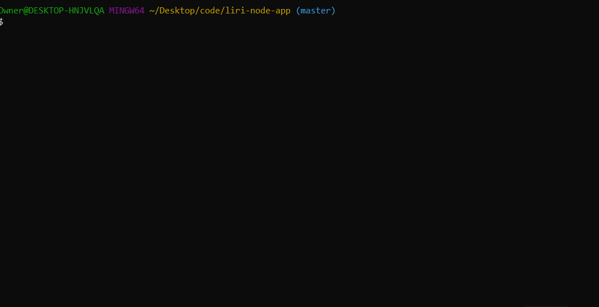

# LIRI
LIRI is a command line interface that searches Spotify for songs, Bands in Town for concerts, and OMDB for movies. It can also search via an input file.


## Running the Application
You will need Node.js to install the required node modules with `npm install`. Afterwards, you'll have to create a `.env` file with your own Spotify API key, like so:

```js
# Spotify API keys

SPOTIFY_ID=your-spotify-id
SPOTIFY_SECRET=your-spotify-secret
```


## The Commands
### `node liri.js concert-this <artist/band name here>`
Searches the Bands in Town Events API for an artist, and displays the following information about each event:
   * Name of the venue
   * Venue location
   * Date of the event

### `node liri.js spotify-this-song <song name here>`
Searches Spotify for a song, and shows the following information for each result:
   * Artist(s)
   * The song's title
   * A preview link
   * Album

Defaults to "The Sign" by Ace of Base if no query is provided.


### `node liri.js movie-this <movie name here>`
Searches the OMDB API for a movie, and outputs the following information:
   * Title
   * Year released
   * IMDB rating
   * Rotten Tomatoes rating
   * Country where the movie was produced
   * Language
   * Plot
   * Actors

Defaults to "Mr. Nobody" if no query is provided.


### `node liri.js do-what-it-says`
Reads from `random.txt` and executes one of the above commands. Currently runs `spotify-this-song` with "I Want it That Way".


## Output
Sample output can be found in `log.txt`.


